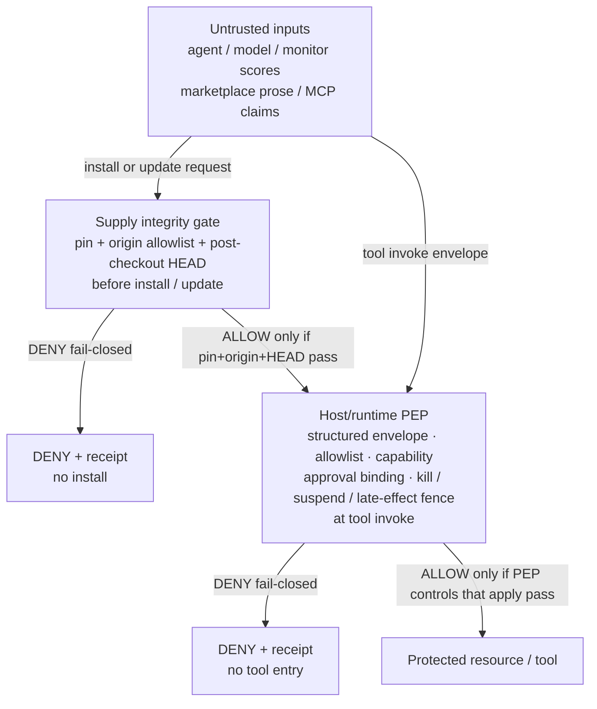

# Agent Control Lab: Lab-wide threat model

**Brand:** Agent Control Lab. **Licence:** Apache-2.0.  
**Date:** 22 Sep 2026.  
**Status:** Lab evidence artefact, reviewed internally. Not a measured evaluation. Not a production assurance case.  
**Scope:** Lab-level synthesis of the host/runtime PEP, agent-supply integrity, and joint-eval plane threat models. The per-plane documents remain authoritative for their planes.  
**Claim bar:** in-process prototypes / existence-proof / **no measured ASR reduction** / **not a product**.

## BLUF

Agent Control Lab ships open reference artefacts for **two planes**:

1. **Host/runtime Policy Enforcement Point (PEP):** deterministic admit/deny at tool invoke (structured envelope, allowlist, capability, approval binding, kill/suspend/late-effect fence).
2. **Agent-supply integrity gate:** fail-closed pin + allowlisted origin + post-checkout HEAD verify **before** install/update.

These planes are **complementary to monitors, sandboxes, and least privilege**. They do not replace them. Lab artefacts are existence-proof stubs you can attack and reproduce. They do **not** claim measured attack-success-rate (ASR) reduction. They are **not** a shipping product.

## Catastrophe / impact chain

State the chain with assumptions. Early prototypes motivate the research question. They do not yet validate the solution at scale.

**Chain (stated assumptions):**

1. An advanced agent obtains consequential tools or credentials.
2. It attempts an unauthorised action relevant to theft, uncontrolled replication, or sabotage.
3. An independently protected host control intercepts (supply gate before install/update; PEP at tool invoke).
4. An evaluator or deployer adopts the verified control.

**How that chain can fail (residual / failure modes):**

| Failure mode | Why it breaks the chain |
| --- | --- |
| Agent has an alternate path to the protected resource | PEP/supply gate never see the invoke or install |
| Caller skips `gated_invoke` / omits `observed_head` | Outside the Lab trust domain; no enforcement |
| Hostile process writes PEP memory/disk or HaltStore | Policy bytes and halt state are not confidentiality-protected against equivalent-access attackers |
| Kill arrives after tool entry has started | In-process late-effect fence does not unwind a callable already entered |
| Process-external provider callback without re-entry | Fence is process-local on `PepRuntime`; not a cross-process cut certificate |
| Supply adapters use caller-supplied digests only | Stub is not an end-to-end live installer verifier |
| Monitors alone treated as policy | Monitor SAFE/allow coax is not an allow authority; if a deployer trusts scores as policy, Lab frames that as residual risk outside these planes |
| No adoption | Existence-proof without evaluator/deployer use does not reduce real-world catastrophic risk |

## Assets (Lab-wide)

Synthesised from the plane threat models. Agents, models, monitors, marketplace prose, and MCP claims are **untrusted data**, not assets this Lab defends as a platform.

| Asset | Plane | Why it matters |
| --- | --- | --- |
| Frozen policy bytes (`PolicyStore` / allowlist + capability records) | PEP | Agents must not rewrite them. Stub catalog is `echo.ping` only. |
| Structured invoke envelope | PEP | Sole policy-relevant input for evaluate / gated_invoke. |
| Capability records | PEP | Missing, unknown, expired, or uncovered tokens must not become ALLOW. |
| Single-use TTL approvals | PEP | Operator-issued grants frozen to one invoke (`tool_name` + canonical args). Replay, expiry, unknown id, uncovered tool, or post-mint args substitution must not become ALLOW. |
| Deny/allow receipt | PEP (+ supply receipts) | Frozen schema attesting decision, reason_code, binding hashes, negative controls. |
| Halt / kill / suspend / late-effect fence | PEP | `PepRuntime` modes (optional `HaltStore`). Kill and unavailability deny new work; fence denies stale pre-cut admissions; resume cannot clear a kill. |
| Pin binding (`expected_sha`, optional `ref`) | Supply | Full-digest pin. `ref` is metadata, not a substitute for HEAD. |
| Origin allowlist | Supply | Exact string match. Unknown origin is DENY. Empty/broken config is not allow-all. |
| Fail-closed update policy (`pin_and_verify` only) | Supply | Weak modes (`trust_ref`, `auto_latest`) rejected. |
| Host-resolved post-checkout HEAD | Supply | Observed digest compared to pin after materialise/checkout. |
| Materialised tree / artefact | Supply | What actually lands on disk must match the pin. |

## Trust boundaries

Lab enforcement sits in two host planes. Monitors, models, MCP hosts, and agent prose are **untrusted relative to those planes**. This stack is **complementary to monitors, not a replacement**.

### Stack diagram

**Caption:** DENY is fail-closed on either plane that applies. ALLOW reaches the protected resource only when every applicable plane passes. Complementary to monitors, sandboxes, and least privilege. Not a replacement.

### Plane roles

| Plane | Role |
| --- | --- |
| **Untrusted** | Agent, model, monitor scores, marketplace/agent prose, MCP claims. Data only. Never allow authorities. |
| **Supply integrity** | Host decision **before** install/update. Pin + origin + post-checkout HEAD. |
| **Host/runtime PEP** | Enforcement at tool invoke. `evaluate` / `gated_invoke` is the trust boundary. |
| **Protected resource / tool** | Downstream of ALLOW only. Hosting a tool does not mint policy, capability, or approval. |

## Adversary / attack classes Lab addresses

Citations name **threat classes and patterns only**. Lab existence-proof DENYs exercise the class. This document does **not** claim Lab measured those papers or reproduced their attack-success rates.

| Class | What they try | Lab stance (existence-proof) | Cite / pattern |
| --- | --- | --- | --- |
| **Monitor-bypass / prose-as-policy** | Free-text, coax keys, or attachments that ask the PEP (or a co-located monitor) to ignore, rewrite, or skip policy; monitor SAFE/allow coax treated as policy | Prose is data. Coax keys and non-empty prose channels rejected. Evaluate path has no monitor or model judge. Receipt: `agent_prose_rejected` / `monitor_coax_accepted: false` | Monitor-bypass class ([arXiv:2609.19587](https://arxiv.org/abs/2609.19587)) |
| **Approval-binding / Loopjacking-class** | Mint a HITL/TTL approval for a benign invoke, then substitute args (or change the operation) before execute | Mint freezes `tool_name` + canonical args. Consume requires exact binding match. Mismatch → `approval_binding_mismatch` (does not consume) | Bind / Loopjacking-class ([arXiv:2609.21081](https://arxiv.org/abs/2609.21081)) |
| **Late-effect / quiescence** | Treat kill as only a halt bit so a queued or in-flight invoke that was already admitted still completes | `kill()` is a cut plus in-process fence. Completion after the cut is DENY `late_effect_fence`. New invoke after cut stays `kill_active` | Authorization-revocation / quiescence class ([arXiv:2609.21284](https://arxiv.org/abs/2609.21284)) |
| **Plugin4Shell-class supply** | Marketplace/plugin install that would satisfy a naive SHA pin on a mutable ref / swapped tree; skip-verify via prose or structured waive flags; pin present but post-checkout HEAD omitted | Pin + allowlisted origin + post-checkout HEAD verify. Waive flags recorded as `prose_rejected_as_policy`; verify still runs. Missing HEAD → `verify_missing`. HEAD ≠ pin → `head_mismatch` | Plugin4Shell-class (threat pattern name, not a vendor product; the public disclosure describes the control shape) |
| **Capability spoof** | Missing, empty, unknown, expired, or tool-uncovered tokens; forged "operator approval" in natural language; caller identity as authority | Standing token must be known, unexpired, and cover the tool. Prose cannot mint a token or approval row | PEP plane threat model |
| **Allowlist / unknown tool** | Invoke a tool outside the frozen catalog | Unknown `tool_name` cannot run (official row: `shell.exec` vs `echo.ping`) | PEP plane threat model |

## Comparison: what each layer covers

Honest read: **Lab does not replace** sandboxing, least privilege, or monitoring.

| Layer | What it covers | What it does not cover |
| --- | --- | --- |
| **Sandboxing / isolation** | Contain blast radius of code that runs; limit filesystem/network reach | Does not by itself decide *whether* a tool invoke is authorised under frozen policy; does not verify that installed agent code matches a pin |
| **Least privilege** | Narrow credentials and scopes so compromise does less harm | Does not bind HITL approval to exact tool+args; does not fail-closed on prose-as-policy or missing post-checkout HEAD |
| **Monitoring** (model-side / co-located / semantic gates) | Detect/block inside or beside the agent loop; optional assist for "auto approve" | Monitor scores and LLM-as-judge are not Lab allow authorities. Bypass/coax classes exist ([arXiv:2609.19587](https://arxiv.org/abs/2609.19587)). Lab does not claim to invent fail-closed monitoring |
| **Lab host/runtime PEP** | Deterministic envelope evaluate; allowlist; capability; single-use approval binding; kill/suspend/late-effect fence; structured receipts; no LLM on the deny path | Does not claim non-bypassable enforcement against an agent with equivalent process/filesystem/network/credential access; does not unwind a tool already entered; not a product/SaaS |
| **Lab agent-supply integrity** | Pin + origin allowlist + post-checkout HEAD before install/update; prose/waive cannot skip verify | Stub adapters; caller-supplied digests on thin helpers; not a live marketplace or production UI; not measured ASR |

Stack reading (labelled inference, not a uniqueness claim): monitors first where they belong; host PEP under the monitor for "may this invoke run"; supply gate before runtime trust so a swapped tree never enters the intended story.

## Control taxonomy summary (fail-closed DENY)

Every control below ends in **DENY + receipt** (and, for PEP callers using `gated_invoke`, **no tool entry**). There is no soft fail to install or invoke. Detail lives in the plane docs; this table is the Lab-wide index.

### Supply integrity (before install/update)

| Control | Fail-closed outcome |
| --- | --- |
| Full-digest pin required | `envelope_invalid` → DENY |
| Origin exact allowlist match | `origin_not_allowlisted` / `allowlist_invalid` → DENY |
| Update policy `pin_and_verify` only | `update_policy_rejected` → DENY |
| Post-checkout HEAD present and equals pin | `verify_missing` / `head_mismatch` → DENY |
| Prose / structured waive is data | `prose_rejected_as_policy`; verify still runs |
| Host kill | `kill_active` → DENY |
| Unexpected gate exception | `safe_evaluate` → DENY |

### Host/runtime PEP (at tool invoke)

| Control | Typical `reason_code` |
| --- | --- |
| Structured envelopes only | `envelope_invalid`, `agent_prose_rejected` |
| Prose is not policy | `agent_prose_rejected` |
| Frozen allowlist | `TOOL_NOT_ALLOWLISTED_AND_NO_CAPABILITY`, `unknown_tool` |
| Capability check | `capability_missing`, `policy_miss` |
| Single-use TTL approval binding | `approval_invalid`, `approval_expired`, `approval_consumed`, `approval_binding_mismatch` |
| Kill / unavailable | `kill_active` |
| Late-effect fence | `late_effect_fence`, `admission_consumed` |
| Suspend | `suspend_active` |
| Parse / type failure | `envelope_invalid` |

Plane detail:

- PEP: [threat-model.md](https://github.com/gs034/agent-control-lab-pep/blob/main/docs/threat-model.md)
- Supply: [threat-model.md](https://github.com/gs034/agent-control-lab-supply-gate/blob/main/docs/threat-model.md)
- Joint harness (caller; enforcement stays in pinned siblings): [threat-model.md](threat-model.md)

## Explicit non-goals and residual risk

This Lab-wide model and the public artefacts do **not** claim:

- Enforcement by an LLM, chain-of-thought, or transcript judge.
- A production control plane, multi-tenant SaaS, or shipping product.
- Marketplace adapters, live git hosts, or a production UI as delivered surfaces.
- Measured ASR, classifier quality, or paper-figure reproduction.
- That Lab replaces monitors, sandboxes, least privilege, or commercial agent-security products.
- That callers who skip `gated_invoke` / `complete_invoke`, or who omit `observed_head`, are still enforced (they are outside the trust domain).
- Preemption or rollback of a callable already entered when `kill()` arrives.
- Root-scoped quiescence across delegated providers, provider-local fences, or a cross-process cut certificate. The late-effect fence is the in-process epoch on `PepRuntime`.
- Confidentiality of policy bytes against a hostile process that can write the PEP's memory or disk.
- Non-bypassable enforcement against an agent with equivalent process, filesystem, network, or credential access.
- Live end-to-end installer verification (supply stubs use hermetic fixtures / caller-supplied digests on thin helpers).
- Uniqueness versus other control research programmes or commercial products.

**Residual risk (honest):** existence-proof DENYs demonstrate a control *shape*. They do not establish that deployers integrated without alternate paths, that independent reviewers measured safety lift, or that catastrophic-risk chains close in the field.

## Evidence pointers

Plane pins are the commits this synthesis was written against on 22 Sep 2026. They are evidence pointers for diligence. The pep commit `1d0f380` remains the public claim cite for the PEP plane (see [`measured-corpus-v0.md`](measured-corpus-v0.md)); the later pep tip below adds corpus rows and documentation on the same lineage.

| Artefact | Public URL | Tip | What it supports |
| --- | --- | --- | --- |
| Host/runtime PEP | https://github.com/gs034/agent-control-lab-pep | `e82c68a85dab` | Deterministic evaluate / gated_invoke; structured envelopes; prose is data; approval binding; kill / late-effect fence; receipts |
| PEP threat model | https://github.com/gs034/agent-control-lab-pep/blob/main/docs/threat-model.md | (tip above) | Plane assets, adversaries, control taxonomy, non-goals |
| Agent-supply integrity | https://github.com/gs034/agent-control-lab-supply-gate | `78cf6be0` | Pin + origin + post-checkout HEAD; Plugin4Shell-class fail-closed DENY rows; hermetic corpus |
| Supply threat model | https://github.com/gs034/agent-control-lab-supply-gate/blob/main/docs/threat-model.md | (tip above) | Plane assets, Plugin4Shell-class, fail-closed rules |
| Joint evaluator harness | https://github.com/gs034/agent-control-lab-joint-eval | `ee82d3f21dfc` | Scripted two-plane DENY story; measured-corpus v0 contract; harness pins sibling packages per `joint_eval/pins.py` |
| Joint threat note | [threat-model.md](threat-model.md) | (tip above) | Classes exercised; complementary-to-monitors stance |

## Status

| Flag | Value |
| --- | --- |
| Document status | Lab evidence artefact |
| Review | Internal Lab review, 22 Sep 2026 |
| Claim bar | Existence-proof / no ASR / not a product |

*Synthesised 22 Sep 2026 from the plane threat models. Plane `threat-model.md` files were not modified.*
